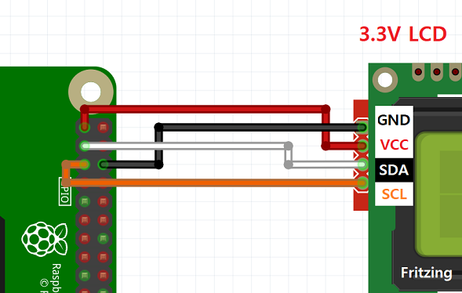
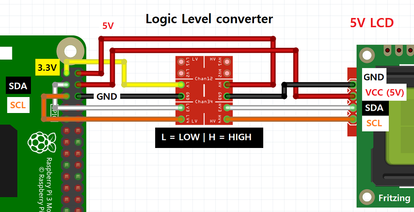

# RPi_I2C_LCD_driver  

This Python module for accessing the I2C LCD on a Raspberry Pi.  

for reference  
https://www.arduino.cc/en/Reference/LiquidCrystal


## Installation

```sh
cd ~/Downloads/ && sudo rm -rf RPi_I2C_driver
git clone https://github.com/everylumi/RPi_I2C_LCD_driver.git
cd RPi_I2C_LCD_driver/RPi_I2C_driver
sudo python3 setup.py install #Python3
```


## Uninstallation

```sh
sudo pip3 uninstall RPi_I2C_driver  #Python3  
```

  
## Connection 
  
### Using 3.3V LCD  
  
  
  
### Using 5V LCD with Logic Level converter (bidirection type)  
  
  
  
 
 
## Usage
 
First, ensure the device is available on the i2c bus:

```
$ sudo i2cdetect -y 1
```

See example of usage in the example folder.


